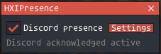
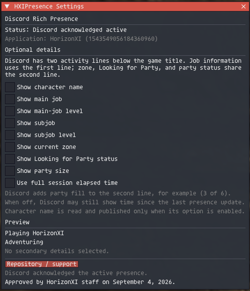
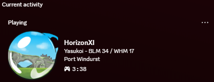

# HXIPresence

HXIPresence is an Ashita v4 addon that displays your HorizonXI activity in
Discord Rich Presence.

Created by **DragoHorse**.

> **Approved:** HXIPresence was approved by HorizonXI staff on September 4,
> 2026.

## Features

Every displayed detail is optional and disabled by default:

- character name
- main job and level
- subjob and level
- current zone
- Looking for Party status
- party size, such as `In Party (3 of 6)`
- elapsed play session time

With all optional details disabled, Discord shows `Playing HorizonXI` and
`Adventuring`.

## Preview

Compact control window:



Settings and activity preview:



Discord activity:



## Requirements

- Ashita v4
- the Discord desktop application running on the same computer

**No Discord Developer Portal setup is required.** The shared Discord
Application ID and artwork are already configured in the addon. Users do not
need to create an application, bot, token, or webhook.

## Installation

1. Download `HXIPresence-v0.4.4.zip` from the
   [latest release](https://github.com/ryuutatsuo23-max/HXIPresence/releases/latest).
2. Extract the included `HXIPresence` folder into Ashita's `addons` folder.
3. Confirm the resulting path is `addons\HXIPresence\HXIPresence.lua`.
4. In game, run:

   ```text
   /addon load HXIPresence
   ```

5. Open the addon controls:

   ```text
   /hxipresence
   ```

6. Enable Discord presence and choose which details you want to show.

## Usage

`/hxipresence` opens or closes the compact control window. Its **Settings**
button opens all optional display settings and a preview.

Discord uses two activity lines below the game title:

- character and job information use the first line
- zone, Looking for Party, and party information use the second line

Updates may take up to 15 seconds. Disabling or unloading HXIPresence clears the
activity it published.

The enabled state and optional detail choices are saved per character and
restored automatically after login. A character profile that has not enabled
HXIPresence before still starts disabled.

## Privacy

- The addon starts disabled.
- All optional details start disabled.
- Character name is read only when its option is enabled.
- Activity is sent only to the local Discord desktop client.
- No Discord credentials, external server, telemetry, game input, packet
  injection, or game-memory writes are used.
- Search comments are never read or published.

## Support and feature requests

Use [GitHub Issues](https://github.com/ryuutatsuo23-max/HXIPresence/issues) to
report a bug or request a feature. The same repository link is available from
the addon's Settings window.

## License

HXIPresence is available under the [MIT License](LICENSE).
