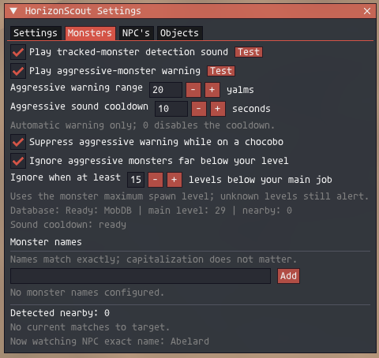
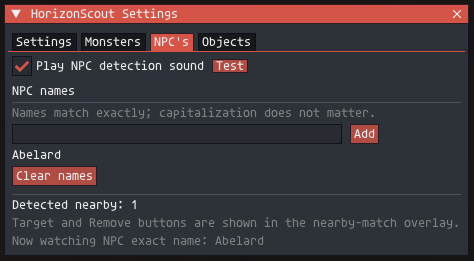

# HorizonScout

HorizonScout is an Ashita v4 addon for finding nearby monsters, NPCs, and
interactable objects in Final Fantasy XI.

It provides:

- Exact-name alerts with separate custom sounds for monsters, NPCs, and objects.
- A small nearby-results panel with compact mode, an icon-only settings button,
  `Add current target`, `Target`, and `Remove` controls.
- Your current area, Vana'diel time, and map-grid position, such as `H-9`.
- A compass radar with blue player dots, red monster dots, and green NPC/object
  dots.
- Smooth radar movement: full discovery remains on the bounded half-second scan,
  while already-known dot positions refresh up to 30 times per second.
- Gold rings around tracked radar dots and a white diamond around your selected
  target. The dot itself keeps its normal category colour.
- A circle or square radar frame, a thin 20-yalm reference circle, category
  filters, optional north-up mode, and optional dot hover details showing the
  entity name, category, distance, and relative-height hint.
- `[Above]` / `[Below]` hints beside nearby matches with a height difference of
  at least 4 yalms by default. The threshold is adjustable. These indicate
  relative height, not a floor number or a route.
- Optional warnings when a nearby monster is marked aggressive by MobDB.
- Gold star markers for monsters identified as Notorious by MobDB, with an
  optional edge-triggered chat notification.
- Named tracking presets with optional automatic per-area activation.
- Optional manual camp timers with saved respawn estimates and one-time chat notices.

HorizonScout only observes nearby rendered entities. It does not move your
character, interact with targets, send gameplay commands, or search an entire
zone.

> HorizonScout is a custom addon. Check the current HorizonXI addon rules before
> using it on the live server.

## Development checkpoint: v0.20.1

This branch includes the current development addon; the existing v0.16.1 release
ZIP remains unchanged. No v0.20.1 release package has been published.

125 focused offline tests passed. Camp folding, new-camp binding defaults and
sound preview were confirmed in game. The new Alive/estimate display through a
full kill-respawn cycle and automatic camp-window audio still need live validation.
NM audio preview works; actual NM detection audio remains unverified.

## Preview

Real in-game screenshots showing the nearby tracker, radar, and settings. These
show example configurations from an earlier interface revision, so some labels
and newer features differ from the current development version.

<table>
  <tr>
    <th>Nearby tracker</th>
    <th>Radar</th>
  </tr>
  <tr>
    <td valign="top"></td>
    <td valign="top"></td>
  </tr>
</table>

Blue dots are players, red dots are monsters, and green dots are NPCs or objects.
`Target` selects a detected entity without interacting with it.

<details>
<summary>View earlier settings examples</summary>

### Settings

Shared scanning, display, radar, volume, and tracking-range controls.


### Monsters

Tracked-monster sound, aggressive warning range and cooldown, chocobo suppression,
and level filtering. The database status here shows `Ready: MobDB`.



### NPC's

Exact-name NPC tracking and its separate sound control.



### Objects

Exact-name object tracking and its separate sound control.


</details>

## Requirements

- Final Fantasy XI running through Ashita v4.
- MobDB or XIUI's included MobDB data for aggressive-monster warnings and
  Notorious Monster identification.

Normal name tracking, the compass, map position, and radar do not require MobDB.

## Installation

1. Download `HorizonScout-v0.16.1.zip` from the
   [GitHub Releases page](https://github.com/ryuutatsuo23-max/HorizonScout/releases/latest).
2. Extract the ZIP. It contains one folder named `HorizonScout`.
3. Copy that folder to your Ashita addons directory. A typical HorizonXI path is:

   ```text
   C:\Games\HorizonXI\Game\addons\HorizonScout
   ```

4. In game, load the addon:

   ```text
   /addon load HorizonScout
   ```

5. Open the settings window:

   ```text
   /horizonscout
   ```

After updating an existing installation, use:

```text
/addon reload HorizonScout
```

## Everyday use

The settings window has six main tabs. Longer pages use small subtabs so related
controls stay together and the window remains easy to scan.

### Settings

- `General`: pause scanning, control routine chat notices, alert volume, the
  shared tracked-sound cooldown, tracking range, and command help.
- `Overlay`: show, resize, lock, or compact the small results panel.
- Collapse the results panel into a compact one-line information header.
- Lock the small results panel after placing it.
- Show your map-grid position.
- Show or hide above/below hints and adjust their yalm threshold.
- `Radar`: show, move, lock, resize, or hide the radar; choose a circle or square
  frame; and optionally keep north upward.
- Enable or disable tracked-dot rings and the selected-target diamond.
- Show or hide players and enable optional radar hover details.
- Optionally hide radar dots more than a chosen number of yalms above or below
  you. Entities whose height cannot be read remain visible.
- Adjust the shared alert volume from 0% to 150%.
- Adjust the normal tracked-name and radar range.

### Monsters

- `Tracking`: show monsters on the radar, manage exact names, and configure the
  tracked-monster sound.
- `Aggro & NM`: show only MobDB-classified aggressive monsters, manage warning
  behavior, and configure Notorious Monster markers.
- Show or hide MobDB-backed Notorious Monster stars and optionally print one
  chat notification when a newly seen NM enters the radar.
- Add exact monster names to track.
- Add the currently selected monster without typing its name.
- Remove one tracked monster with the `X` beside its name, or clear the entire
  monster list with `Clear names`.
- Enable or test `mobalert.wav`.
- Enable or test aggressive-monster warnings.
- Adjust the aggressive warning range and sound cooldown.
- Optionally suppress aggressive warnings for monsters more than a chosen
  number of yalms above or below you. Unknown monster heights still warn.
- Suppress aggressive warnings while riding a chocobo.
- Ignore aggressive monsters far below your current main-job level.

### NPC's

- Show or hide NPCs on the radar.
- Add exact NPC names to track.
- Add the currently selected NPC without typing its name.
- Remove one tracked NPC with the `X` beside its name, or clear the entire NPC
  list with `Clear names`.
- Enable or test `npcalert.wav`.

### Objects

- Show or hide interactable objects on the radar.
- Add exact names for doors, monuments, `???` targets, and other interactable
  objects.
- Add the currently selected object without typing its name.
- Remove one tracked object with the `X` beside its name, or clear the entire
  object list with `Clear names`.
- Enable or test `interactablealert.wav`.

### Camps

1. Open `Camps` and enable camp timers (off by default).
2. Enter a camp label and its earliest/latest respawn estimates in **real-world
   minutes** (1-10080). Equal values give a fixed estimate.
3. Click `Add camp`, then click `Record death now` when you observe the kill.
   Clicking it again restarts that camp's timer.
4. Read `Waiting`, `Window open`, or `Overdue` in the Camps tab. An open window
   is only an estimate, **not confirmation that the monster has spawned**.

Timings can be adjusted on each camp. `Stop` clears its running timer without
removing the camp and disables its automatic death tracking; `X` removes that camp. Use distinct labels for different camps
with the same monster name. Up to 50 camps can be saved.

Camp timers belong to your character's settings, independently of tracking presets
and areas. They survive zoning, addon reloads, and restarting the game. Time spent
offline still counts. Disabling Camps retains the timers; it does not freeze time.
Pausing entity scanning does not pause Camps.

The optional chat notification is off by default and fires once per recorded death,
even when routine chat notices are off. Several simultaneous windows produce one
summary message. If a window was reached while offline, the next load reports it
once (including whether it has already passed). Windows processed with notices off
are not replayed when notices are later enabled. Editing timings does not re-arm
a notice; recording another death does. No existing detection WAV is reused.

For optional **experimental observed-death tracking**, select a living monster and
use `Bind selected monster` or `Bind selected NM placeholder` on a camp. New camps
enable `Start on observed death` on their first successful binding. Existing camps
keep their saved choices; rebinding does not automatically enable tracking.
Check the displayed identity and timings. One spawn is bound per
camp; use separate camps/timings for a placeholder and an NM. Binding does not
start a timer. `Unbind` removes the association without clearing its existing timer.

Automatic recording requires first observing the spawn alive, continuing to
confirm its exact identity, and receiving a recognized incoming death message.
Zone, server ID, spawn index, and name must match. Matching zero-HP readings keep
that observed life eligible while waiting for the explicit defeat; zero HP alone
never starts a timer. A corpse not previously observed alive cannot arm tracking.
Missing readings have a two-second grace period from the last identity confirmation.
A longer gap requires a fresh living observation; zero HP cannot bridge it. With
an unreadable entity, acceptance still requires the exact defeat ID/index and
an independently confirmed current zone; a readable conflicting identity is rejected.
It can observe original server messages
hidden by combat-log replacements without unblocking them; injected messages
are ignored.
Disappearing, zoning, or leaving radar range never counts as a death. Duplicate death messages
do not restart a timer. Missing observations/messages can miss a kill; use
`Record death now` as the fallback. After a reload or zone change, a fresh living
observation is required. This needs live Horizon testing; offline fixtures alone
do not establish every kill method is supported.

Enable `Show camp diagnostics` (off by default) to see each bound camp's zone/ID,
`Observer` readiness and timestamped `Last defeat check`.
These session-only details explain acceptance/rejection of matching supported defeat
messages without chat spam or packet logging. Reloading or rebinding clears the
diagnostic history. If a kill is missed, capture these lines before rebinding.
The defeat snapshot includes the living-observation age, identity-confirmation age, last-scan age, last-scan
HP/read result, and read result at the defeat. These details survive evidence
expiry for diagnosis only; they do not extend the two-second missing-read grace.

Placeholder assignments are supplied by you, not discovered or verified by MobDB.
An optional `P` marker identifies that exact bound placeholder on the radar;
hover details also label it as user assigned. Existing radar category/range/height
filters still apply. No built-in spawn timings or NM/placeholder relationships
are imported. Camps remain independent of name-tracking presets.

The Camps tab separates current presence from the respawn estimate. A fresh,
exact-identity positive-HP observation shows `Alive - bound spawn detected`, with
the previous estimate subdued underneath. Otherwise it says the bound spawn is
not currently observed alive; this does not prove death or absence. Observing a
return does not erase the recorded death or change the next-death tracking rules.
`Create camp` is collapsible to leave more room for existing camps.
Each camp also has its own expand/collapse arrow. Collapsed entries retain a
compact live-presence or timer summary; expand to edit, bind, stop or remove one.
These UI folds do not pause timers or alerts. `NM placeholder` means a monster
assigned by you as a possible replacement spawn for an NM, not the NM itself.

Optional `Play sound when a window opens` uses `Camps.wav` and the shared alert
volume; it is off by default and independent of chat. Use `Test` to preview it.
Simultaneous windows share one sound, with a 10-second camp sound cooldown.
Pending audio waits up to 10 seconds for other audio, then is discarded. Stopped,
removed or restarted timers cannot play their old pending alert. Windows already
processed with sound off are not replayed when enabling it. This is an estimated
window notification, not proof of a spawn. Changing the computer clock affects
estimates; a timestamp in the future shows `Clock changed`.

### Presets

- The existing monster, NPC, and object lists migrate into `Default`.
- Create an empty preset or copy the currently active preset.
- Choose the fallback preset used in areas without an assignment.
- Assign a preset to the current area so HorizonScout activates it
  automatically whenever you enter that area.
- Remove an area assignment to return that area to the fallback preset.
- `Default` cannot be deleted, which preserves a safe compatible list.
- Export the active preset as portable text, then copy it to another player or
  installation. Import always creates and activates a new preset; it never
  overwrites existing presets or changes area assignments. A duplicate name is
  renamed automatically.

Names match exactly, but capitalization does not matter. For example, `Sand Bat`
will also match `sand bat`.

When a tracked result is nearby, the small panel offers:

- Gear: opens or closes the settings window using Ashita's bundled
  `ICON_FA_GEAR` glyph. It uses a transparent icon-only button, so no image file
  is required.
- Compact control: collapses the panel to a one-line area/time/position header;
  expand it again to use match and target controls.
- `Add current target`: adds the selected monster automatically. NPC-class
  targets without a reliable object flag ask whether to add them as an NPC or
  Object, because Horizon can expose world objects as ordinary NPC entities.
- `Target`: selects the entity without interacting with it.
- `Remove`: stops watching that exact name.

## Default settings

| Setting | Default |
| --- | ---: |
| Tracked-name and radar range | 50 yalms |
| Tracked monster/NPC/object sound cooldown | 10 seconds |
| Aggressive warning range | 18 yalms |
| Aggressive sound cooldown | 10 seconds |
| Aggressive vertical filter | Off |
| Aggressive vertical range | 10 yalms above or below |
| Ignore aggressive monsters below your level | 15 levels |
| Chocobo suppression | On |
| Overlay position lock | Off |
| Compact overlay mode | Off |
| Above/below threshold | 4 yalms |
| Player, monster, NPC and object radar categories | On |
| Aggressive-only monster radar filter | Off |
| Notorious Monster star markers | On |
| Notorious Monster chat notification | Off |
| Radar hover details | Off |
| Radar vertical filter | Off |
| Radar vertical range | 10 yalms above or below |
| Keep radar north-up | Off |
| Radar shape | Circle |
| Active/fallback tracking preset | Default |
| Automatic area assignments | None |
| Alert volume | 100% |
| Small results-panel scale | 100% |
| Radar size | 112 px |

The aggressive cooldown prevents a second aggressive monster, or rapid movement
in and out of range, from restarting the WAV. Set it to `0` to disable the
cooldown. Detection and the nearby count continue normally during the cooldown.

The tracked-sound cooldown is shared by monster, NPC, and object name alerts so
their WAV files cannot interrupt one another. If several categories are first
detected in the same scan, only the closest new match's category sound plays.
Overlay results and routine chat notices are not suppressed. Set the cooldown to
`0` to permit a new sound on every qualifying scan while still limiting one WAV
to that scan.

## Useful commands

`/hs` is the short alias for `/horizonscout`. The older `/mobalert` name is also
accepted. HorizonScout deliberately does not use `/ma`, because `/ma` is FFXI's
magic command.

```text
/horizonscout                         Open or close settings
/horizonscout add <monster name>      Add a monster name
/horizonscout remove <monster name>   Remove a monster name
/horizonscout addnpc <NPC name>       Add an NPC name
/horizonscout removenpc <NPC name>    Remove an NPC name
/horizonscout addobject <name>        Add an object name
/horizonscout removeobject <name>     Remove an object name
/horizonscout on|off                  Resume or pause scanning
/horizonscout show|hide               Show or hide the results panel
/horizonscout compass on|off          Show or hide the compass
/horizonscout range <1-50>            Set tracked-name/radar range
/horizonscout aggrorange <1-50>       Set aggressive warning range
/horizonscout aggrocooldown <0-60>    Set aggressive sound cooldown
/horizonscout sound on|off|test       Monster alert sound
/horizonscout npcsound on|off|test    NPC alert sound
/horizonscout objectsound on|off|test Object alert sound
/horizonscout aggrosound on|off|test  Aggressive warning sound
/horizonscout help                    Show all commands in settings
```

## Custom sound files

HorizonScout includes these sounds:

- `mobalert.wav` for tracked monsters.
- `npcalert.wav` for tracked NPCs.
- `interactablealert.wav` for tracked objects.
- `aggressivealert.wav` for aggressive-monster warnings.
- `Notorious Monster.wav` for MobDB-identified NM radar sightings.
- `Camps.wav` for estimated camp window openings.

You can replace a sound by keeping the same filename. For best compatibility
with the volume control, use an uncompressed PCM WAV: mono, 16-bit, 48 kHz.

## Aggressive-monster warning

This feature reads local MobDB data. HorizonScout prefers the exact spawn-index
record, then falls back to the monster name when no spawn record exists.

By default, a monster is ignored when its maximum MobDB level is at least 15
levels below your current synchronized main-job level. Monsters with missing or
zero level data still warn so that uncertain data does not silently hide a
possible threat.

The warning is a nearby safety reminder, not a guarantee that a monster will
aggro. MobDB cannot account for walls, facing direction, Sneak, Invisible,
time/weather rules, or special conditions such as low-HP blood aggro.

Notorious Monster stars use the same local database and are therefore
best-effort. HorizonScout only marks entries whose MobDB record explicitly has
the `Notorious` field; missing or unknown records are never guessed. The
optional NM chat notice and sound are independently enabled in `Monsters` →
`Aggro & NM`. The NM sound is off by default, uses the shared volume setting,
and has its own adjustable 0–60-second cooldown (default 10). Multiple new NMs
produce at most one sound. Pending NM audio waits for existing playback, and is
discarded if that NM leaves radar detection before playback. Other automatic
alerts do not interrupt the NM recording. The `Test` button plays the recording
without needing an actual NM. Identification remains database-dependent.

## Troubleshooting

### The settings window does not open

Use `/horizonscout` or `/hs`. Then try reloading the addon:

```text
/addon reload HorizonScout
```

### A normal name alert does not appear

- Confirm the name was added to the correct tab.
- Confirm the spelling matches the in-game name exactly.
- The entity must be rendered and within the configured range.

### Aggressive warnings do not work

- Open the Monsters tab and check the database status.
- It should show `Ready: MobDB` or `Ready: XIUI MobDB`.
- Confirm the warning sound is enabled.
- Check the chocobo, level-gap, range, and cooldown settings.

### A sound does not play

- Check that alert volume is above 0%.
- Use the category's `Test` button.
- Confirm the matching WAV file is present in the HorizonScout folder.

## License

HorizonScout is released under the [MIT License](LICENSE).
