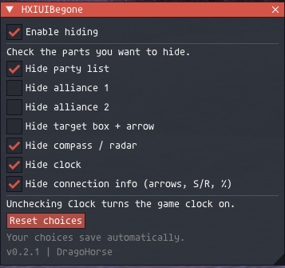

# HXIUIBegone

**A cleaner FFXI screen, one checkbox at a time.**

An addon for **Ashita v4**, made by **DragoHorse**. Choose which parts of the
game's interface to hide, without installing a separate addon for each one.

[Download the latest release](https://github.com/ryuutatsuo23-max/HXIUIBegone/releases/latest)
· [Report a problem](https://github.com/ryuutatsuo23-max/HXIUIBegone/issues)



## What can I hide?

- Party list
- Alliance 1 and alliance 2, separately
- Target box, while keeping the arrow above your selected target
- Native cast bar
- Compass / radar
- Clock
- Connection info: arrows, S/R counters, and percentage

You choose what stays visible. HXIUIBegone does not draw a replacement interface.

## Install

1. Open [Releases](https://github.com/ryuutatsuo23-max/HXIUIBegone/releases/latest)
   and download **HXIUIBegone-v0.2.6.zip** under **Assets**.
2. Extract the ZIP into your `HorizonXI\Game\addons` folder.
3. In game, load the addon:

   ```text
   /addon load HXIUIBegone
   ```

4. Open settings:

   ```text
   /hxiuibegone
   ```

The main file should be at `addons\HXIUIBegone\HXIUIBegone.lua`.
Use the release ZIP above rather than GitHub's **Source code** downloads to get
the correct folder layout. Ashita v4 is required; this is not a Windower addon.

The install ZIP contains only four Lua files, the license, and credits.
Tests and packaging tools are kept in `dev/`; documentation and research are
kept in `docs/`. None of these folders is included in the install ZIP.

**Updating?** Run `/addon unload HXIUIBegone` first, replace the addon files,
then load it again. Keep your saved settings.

## Using the settings

Check a box to hide that part of the interface. Uncheck it to let the game
display it normally again.

- **Enable hiding** turns your selected hides on or pauses them.
- **Reset choices** asks for confirmation, then clears all selections and turns
  hiding off.
- **Retry** appears if an option has a problem.

Your choices save automatically and apply when the addon loads. The settings
window stays closed until you type `/hxiuibegone`. Closing it does not stop
your selected hides. `/hxiui` also opens settings.

Use `/hxiuibegone toggle` to pause or resume hiding without opening settings or
clearing your choices. Hover over a checkbox for a short hint about special cases.

All hide options start unchecked on a fresh install. The preview shows an
example setup, not the defaults.

## A few things to know

- **Target arrow:** The target option moves only the native box and icon
  coordinates off-screen. The separate main-target and sub-target arrow
  coordinates remain under the game’s control.
- **Fishing:** The party-list hide pauses automatically while you are fishing so
  the hooked-fish HP bar can remain visible. The party list also returns during
  that time because both currently share one native primitive.
- **Cast bar:** This was confirmed working on the author's HorizonXI setup. The
  bar may flash for less than a second before the addon hides it.
- **Clock:** Unchecking it turns the game clock on, even if it was off before.
- **Other UI addons:** Do not use two addons to hide the same part of the UI.
  `hideparty` blocks the party, alliance, and target options; FancyCompass blocks
  the compass and clock options while loaded. If moving from `hideparty`, run
  `/hideparty show` before unloading it.
- **Compatibility:** Party, fishing compatibility, target-box separation, cast
  bar, compass, clock, and connection hiding have been
  reported working on a HorizonXI setup. Connection info was also confirmed to
  return when unchecked. Alliance controls, notification behavior, and every
  zoning/login/unload combination still need broader testing.
- **Server rules:** Check your server's addon rules before using custom addons.
  This project does not claim official server approval.

If something looks wrong, try `/hxiuibegone off` to pause hiding. To clear your
choices, use `/hxiuibegone restore`. If the addon reports that it cannot restore
the UI, stop overlapping UI-hiding addons and try again; restart the game if the
problem remains. Use `/clock on` after login if the clock needs restoring.

<details>
<summary>More commands</summary>

| Command | What it does |
| --- | --- |
| `/hxiuibegone` | Open settings |
| `/hxiuibegone toggle` | Pause/resume hiding without clearing choices or opening settings |
| `/hxiuibegone on` | Apply your selected hides |
| `/hxiuibegone off` | Pause hiding, keeping your choices |
| `/hxiuibegone restore` | Reset choices and stop hiding |
| `/hxiuibegone recheck` | Retry unavailable options |
| `/hxiuibegone hide connection off` | Stop hiding connection info |

The last command also accepts `party`, `alliance1`, `alliance2`, `target`,
`castbar`, `compass`, or `clock`. Use `on` to hide and `off` to stop hiding.
All commands also work with `/hxiui`.

</details>

## Credits

Created by **DragoHorse**. Thanks to the Ashita team and the community projects
that helped make this possible. See [credits](CREDITS.md) and
[validation notes](docs/VALIDATION.md) for details.

Licensed under [GPL-3.0-or-later](LICENSE).

Working on the addon? See the [developer notes](dev/README.md).
